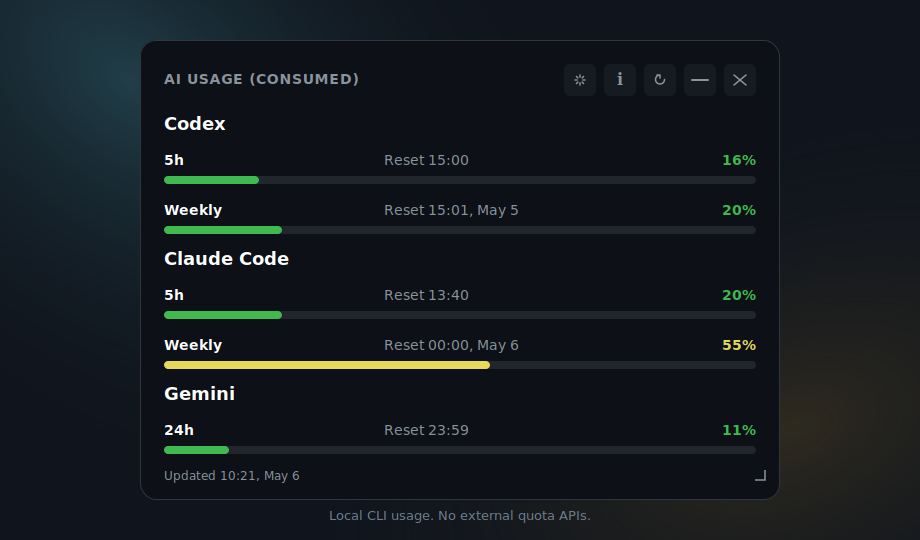

# AI Usage Widget

A compact desktop widget for macOS, Windows, and Ubuntu Desktop that shows remaining usage for local AI coding tools through their CLIs.



Project page: <https://odrasile.github.io/ai-usage-widget/>

## What It Does

AI Usage Widget is a local-first Tauri desktop app. It detects installed AI coding CLIs, asks each one for quota or usage information, and displays the result in a small always-on-top widget.

Supported providers:

- Codex
- Claude Code
- Gemini CLI

The app does not call external APIs to retrieve quota data. It only talks to local command-line tools installed on your machine.

## Features

- Floating, borderless, always-on-top desktop widget.
- Local provider detection for Codex, Claude Code, and Gemini CLI.
- Usage bars for the main limit and weekly limit when available.
- Manual and automatic refresh.
- Previous data stays visible while refreshes are running.
- Tray hide/restore support where the platform supports it.
- English and Spanish UI, selected from the system/browser language or app settings.
- Cross-platform build setup for Windows, Ubuntu Desktop, and macOS.

## Requirements

- macOS, Windows, or Ubuntu Desktop.
- Node.js 20 or newer.
- Rust and Cargo for Tauri builds.
- One or more supported CLIs installed if you want real usage data:
  - `codex`
  - `claude`
  - `gemini`

## Node.js Runtime Policy

Node.js is required on all supported platforms because the app uses a local Node backend to detect CLIs, spawn helper processes, manage PTYs, and parse provider output.

Imports such as `node:fs`, `node:path`, and `node:child_process` are built into Node.js. They are not npm packages and therefore do not appear in `node_modules`.

Recommended installation:

- Windows: install Node.js 20+ from the official installer or with `winget`.
- macOS: install Node.js 20+ with Homebrew, Volta, nvm, or the official installer.
- Ubuntu: install Node.js 20+ with NodeSource, nvm, or a package source that provides version 20 or newer.

The app resolves the `node` binary in this order:

1. `MONITORAI_NODE_BIN`, if set.
2. A bundled Node runtime next to the app, if present.
3. `node` or `nodejs` available in `PATH`.
4. Common system locations.

If the packaged app cannot find Node, set `MONITORAI_NODE_BIN` to the absolute path of the binary:

```bash
MONITORAI_NODE_BIN=/usr/bin/node ./AI-Usage-Widget.AppImage
```

## Ubuntu Dependencies

On Ubuntu, install the usual Tauri/WebKitGTK build dependencies:

```bash
sudo apt update
sudo apt install -y \
  libwebkit2gtk-4.1-dev \
  build-essential \
  curl \
  wget \
  file \
  libxdo-dev \
  libssl-dev \
  libayatana-appindicator3-dev \
  librsvg2-dev
```

## macOS Notes

When started from Finder or the Dock, macOS apps may receive a different `PATH` than the one available in your terminal. The backend adds common Homebrew, MacPorts, global npm, `~/.local/bin`, Cargo, nvm, Volta, and asdf paths before detecting or launching CLIs.

If Node is not available from a standard location, set `MONITORAI_NODE_BIN` to the absolute path of the `node` binary.

## Local Setup

```bash
npm ci
```

Use `npm install` only when intentionally updating dependencies and regenerating `package-lock.json`.

## Development

```bash
npm run tauri:dev
```

The app opens as a floating, borderless, always-on-top widget.

On Windows, widget transparency is a reasonable target. On Linux, real transparency depends on Tauri, WebKitGTK, GTK, the compositor, and the desktop environment. The supported Linux fallback is a stable, readable dark panel.

## Validation

```bash
npm test
npm run build
cargo check --manifest-path src-tauri/Cargo.toml
```

## Local Builds

Local builds generate bundles for the current platform. This is not a complete cross-compilation strategy.

### Windows

```bash
npm run tauri:build
```

Bundles are generated under `src-tauri/target/release/bundle`.

Do not distribute only the standalone `.exe` copied to another folder. The app needs packaged resources next to the bundle, including the Node backend and `node-pty`. For normal use, install from the `.msi` or NSIS installer generated by Tauri.

### Ubuntu

```bash
npm run tauri:build
```

Ubuntu bundles are generated under `src-tauri/target/release/bundle`, usually as `.deb` and/or AppImage depending on the environment.

### macOS

```bash
npm run tauri:build
```

macOS bundles are generated under `src-tauri/target/release/bundle`, usually as `.app` and/or `.dmg` depending on the environment.

## Releases And Installers

Installers should be built on native systems or equivalent CI runners:

- Windows: `windows-latest`
- Ubuntu: `ubuntu-latest`
- macOS: `macos-latest`

The release workflow runs for tags matching `v*` and uploads Tauri bundles to GitHub Releases.

The first distribution can be published without signing or notarization. In that case, users should expect SmartScreen warnings on Windows and Gatekeeper warnings on macOS.

## Optional Configuration

Create `config.json` in the repository root:

```json
{
  "refresh_interval_sec": 45
}
```

The value is clamped between 30 and 120 seconds.

## Scripts

- `npm run dev`: start the Vite frontend server.
- `npm run build`: compile TypeScript and generate `dist`.
- `npm run tauri:dev`: run the Tauri app in development mode.
- `npm run tauri:build`: build the app for the current platform.
- `npm run tauri -- <args>`: pass arguments directly to the Tauri CLI through the local wrapper.
- `npm test`: validate parsers with simulated provider output.

## Security Model

The backend only executes commands from a small whitelist:

- `where codex` / `which codex`
- `where claude` / `which claude`
- `where gemini` / `which gemini`
- `codex ...`
- `claude ...`
- `gemini ...`

Every process uses a timeout. A failing provider should not block the widget or hide data from other providers.

## Contributing

See [CONTRIBUTING.md](./CONTRIBUTING.md) for local setup and pull request guidelines.

Security issues should be reported according to [SECURITY.md](./SECURITY.md).

## Alternatives / Why This Project

There are useful tools in this space, including terminal monitors and provider-specific usage analyzers. AI Usage Widget has a narrower goal: a small desktop widget that reads usage from local CLIs without asking for credentials or calling quota APIs.

| Project | Main focus | Difference from AI Usage Widget |
| --- | --- | --- |
| [CodexBar](https://github.com/search?q=CodexBar&type=repositories) | Codex-oriented status/menu bar tools | AI Usage Widget targets Codex, Claude Code, and Gemini from one cross-platform desktop widget. |
| [ClaudeBar](https://github.com/search?q=ClaudeBar&type=repositories) | Claude-oriented status/menu bar tools | AI Usage Widget is provider-agnostic and keeps provider integrations isolated by adapter/parser. |
| [claude-usage-widget](https://github.com/search?q=claude-usage-widget&type=repositories) | Claude usage widgets | AI Usage Widget also supports Codex and Gemini and is designed for Windows, Ubuntu Desktop, and macOS. |
| [Claude Code Usage Monitor](https://github.com/Maciek-roboblog/Claude-Code-Usage-Monitor) | Rich terminal monitoring for Claude Code | This project is a desktop widget and does not require a terminal dashboard to stay visible. |
| [ccusage](https://github.com/ryoppippi/ccusage) | CLI analysis of local Claude Code/Codex usage files | This project queries local CLIs for current status and displays a compact always-on-top widget. |

Why this project:

- No external quota APIs.
- No credentials collected by the widget.
- Local CLI detection only.
- Cross-platform desktop target: Windows, Ubuntu Desktop, and macOS.
- Fault-tolerant provider model: one failing CLI should not break the rest of the widget.

Related official tools:

- Gemini CLI: <https://github.com/google-gemini/gemini-cli>
- Claude Code: <https://www.anthropic.com/claude-code>
- OpenAI Codex CLI: <https://github.com/openai/codex>
