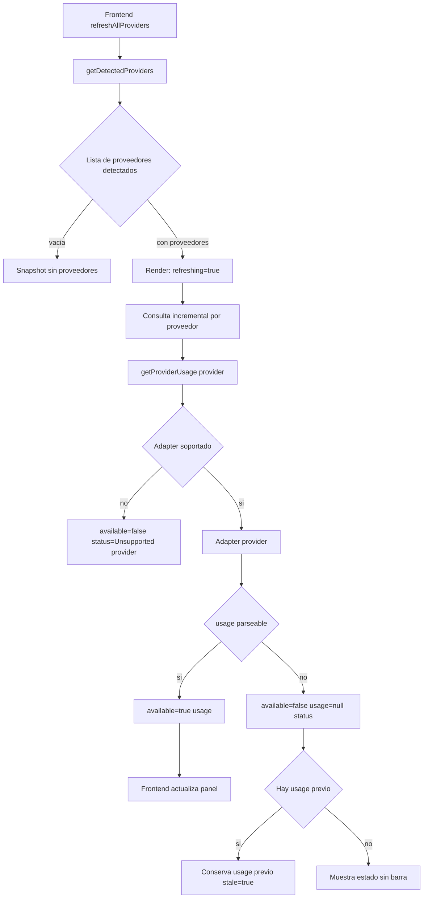
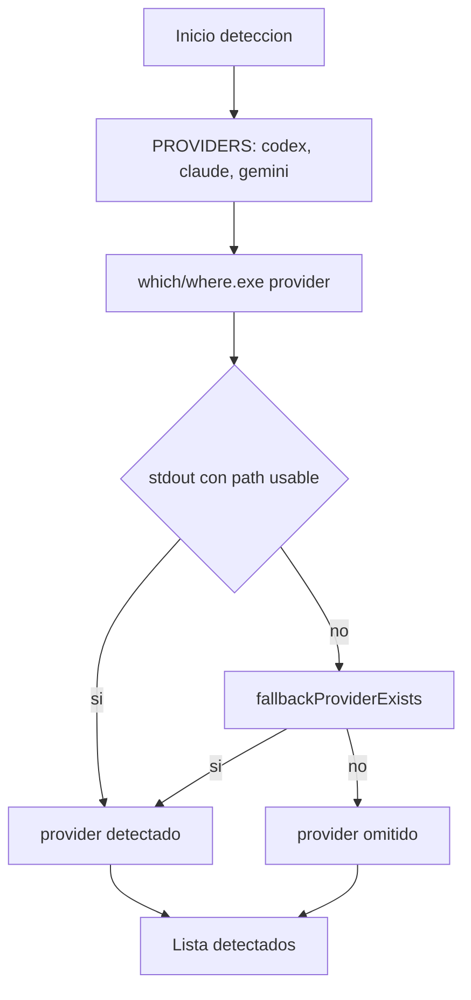
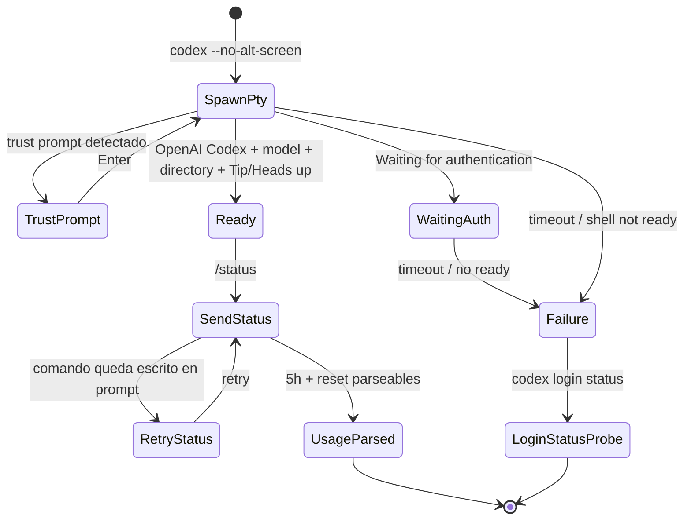
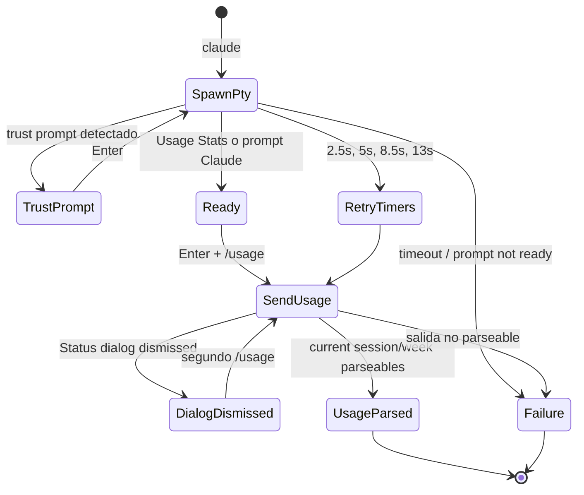
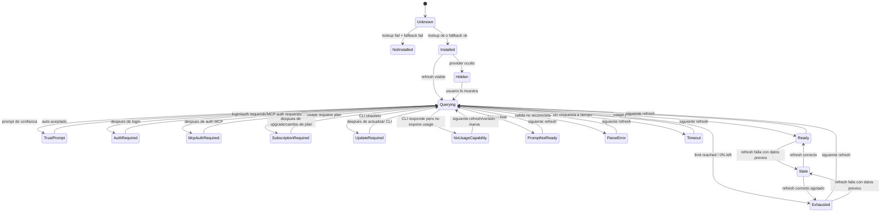
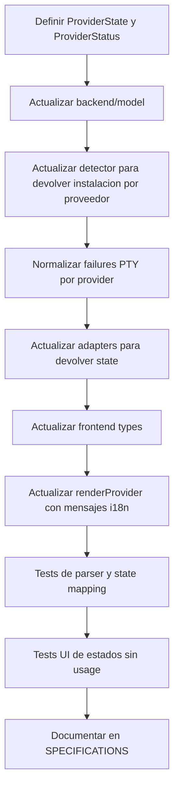

```mermaid
stateDiagram-v2
  [*] --> Platform
  Platform --> WindowsProbe: Windows
  Platform --> PtyProbe: Unix/macOS
  WindowsProbe --> UsageParsed: gemini -p hi muestra quota
  WindowsProbe --> PtyProbe: fallback
  PtyProbe --> TrustPrompt: trust folder
  TrustPrompt --> PtyProbe: Enter
  PtyProbe --> AuthWait: waiting for authentication
  PtyProbe --> ReadyNoQuota: Gemini prompt ready; quota not visible yet
  PtyProbe --> UsageParsed: NN% used
  PtyProbe --> Exhausted: limit reached / exhausted capacity
  AuthWait --> Failure: auth timeout
  ReadyNoQuota --> Failure: quota no visible
  UsageParsed --> [*]
  Exhausted --> [*]
  Failure --> [*]
```

# Provider usage state machine analysis

Fecha: 2026-05-15

## Objetivo

Analizar como se obtiene actualmente el porcentaje consumido para Codex, Claude Code y Gemini CLI, y proponer una maquina de estados explicita para representar los estados reales que puede encontrar el widget:

- CLI no instalado.
- CLI instalado pero sin login.
- CLI instalado con login pero sin suscripcion o plan compatible.
- CLI instalado con usage consultable.
- CLI instalado pero bloqueado por prompts, version, MCP auth, timeout, salida no parseable u otros fallos.
- CLI con datos previos disponibles pero refresco actual fallido.

El objetivo de este documento no es implementar la maquina de estados todavia. Es dejar una especificacion util para una iteracion futura.

## Resumen actual

La implementacion actual no modela estados de proveedor como una maquina explicita. El backend devuelve objetos con esta forma:

```json
{
  "provider": "codex",
  "available": true,
  "usage": {
    "primary": {
      "percent_left": 58,
      "reset": "20:45"
    },
    "weekly": {
      "percent_left": 81,
      "reset": "09:24 on 29 Apr"
    }
  }
}
```

o:

```json
{
  "provider": "codex",
  "available": false,
  "usage": null,
  "status": "Codex CLI detected; login required"
}
```

El estado se infiere en la UI desde `usage`, `available`, `status`, `refreshing` y `stale`, definidos en [src/types.ts](/home/emotai/development/ai-usage-widget/src/types.ts:11). No existe un campo `state`, `reason`, `capability` o `auth_state`.

## Flujo actual de alto nivel



Referencias:

- Deteccion: [backend/detector.js](/home/emotai/development/ai-usage-widget/backend/detector.js:20)
- Dispatch de adapters: [backend/model.js](/home/emotai/development/ai-usage-widget/backend/model.js:19)
- Refresco incremental frontend: [src/main.ts](/home/emotai/development/ai-usage-widget/src/main.ts:544)
- Render sin `usage`: [src/renderer.ts](/home/emotai/development/ai-usage-widget/src/renderer.ts:593)
- Render con `usage`: [src/renderer.ts](/home/emotai/development/ai-usage-widget/src/renderer.ts:616)

## Deteccion actual

La deteccion solo responde a la pregunta "hay ejecutable local detectable?". No intenta saber si hay login, plan, suscripcion o usage consultable.



Consecuencias actuales:

- Un CLI no instalado no aparece en `providers`; la UI no puede mostrar "Codex no instalado" por proveedor.
- Si no hay ningun proveedor detectado, la UI muestra "No providers detected".
- La deteccion cachea resultados positivos durante 5 minutos. Si un CLI desaparece del `PATH`, puede seguir en la lista hasta expirar la cache.
- El estado "instalado pero sin login" solo se descubre despues, durante la consulta del adapter.

## Calculo actual de porcentajes

### Codex

Flujo:



Parsing:

- `parseCodexStatus` extrae `5h` como `percent_left` y reset obligatorio.
- `weekly` es opcional, si aparece se extrae como `usage.weekly`.
- La UI convierte a consumido con `100 - percent_left`.

Ejemplo:

```text
5h limit: ... 61% left (resets 20:45)
Weekly limit: ... 81% left (resets 09:24 on 29 Apr)
```

Resultado:

```json
{
  "primary": { "percent_left": 61, "reset": "20:45" },
  "weekly": { "percent_left": 81, "reset": "09:24 on 29 Apr" }
}
```

Consumo mostrado:

- `5h usage = 39%`
- `Weekly usage = 19%`

Referencias:

- Adapter Codex: [backend/adapters/codex.js](/home/emotai/development/ai-usage-widget/backend/adapters/codex.js:6)
- Envio `/status`: [backend/codexPty.js](/home/emotai/development/ai-usage-widget/backend/codexPty.js:198)
- Parser Codex: [backend/parser.js](/home/emotai/development/ai-usage-widget/backend/parser.js:58)

### Claude Code

Flujo:



Parsing:

- Si encuentra `Current session NN% used`, calcula `primary.percent_left = 100 - NN`.
- Si encuentra `Current week NN% used`, calcula `weekly.percent_left = 100 - NN`.
- Como fallback legacy, si encuentra `Remaining requests` y `Total requests`, calcula `remaining / total * 100`.

Ejemplo:

```text
Current session 15% used Resets 4:30pm
Current week 40% used Resets May 1, 12am
```

Resultado:

```json
{
  "primary": { "percent_left": 85, "reset": "4:30pm" },
  "weekly": { "percent_left": 60, "reset": "May 1, 12am" }
}
```

Consumo mostrado:

- `5h usage = 15%`
- `Weekly usage = 40%`

Referencias:

- Adapter Claude: [backend/adapters/claude.js](/home/emotai/development/ai-usage-widget/backend/adapters/claude.js:5)
- Reintentos `/usage`: [backend/claudePty.js](/home/emotai/development/ai-usage-widget/backend/claudePty.js:88)
- Parser Claude: [backend/parser.js](/home/emotai/development/ai-usage-widget/backend/parser.js:86)

### Gemini CLI

Flujo:



Parsing:

- Si encuentra `NN% used`, calcula `primary.percent_left = 100 - NN`.
- Si encuentra `limit reached`, `exhausted your capacity` o `RESOURCE_EXHAUSTED`, devuelve `primary.percent_left = 0`.
- No modela `weekly`; la UI etiqueta Gemini como `24h`.
- El parser devuelve reset `N/A`, pero la UI fuerza `23:59` para Gemini.
- Si Gemini expone plan/cuota, por ejemplo `Gemini Code Assist for individuals` con `NN% used`, el widget debe tratarlo como `ready` aunque el usuario crea haber hecho logout. Para la maquina de estados, "quota visible" es equivalente operativo a estar autenticado porque el usage es consultable.

Ejemplo:

```text
workspace (...) branch sandbox /model quota
~/repo master no sandbox gemini-3-flash-preview 19% used
```

Resultado:

```json
{
  "primary": { "percent_left": 81, "reset": "N/A" },
  "status": "Gemini"
}
```

Consumo mostrado:

- `24h usage = 19%`

Referencias:

- Adapter Gemini: [backend/adapters/gemini.js](/home/emotai/development/ai-usage-widget/backend/adapters/gemini.js:8)
- Deteccion de quota en PTY: [backend/geminiPty.js](/home/emotai/development/ai-usage-widget/backend/geminiPty.js:129)
- Parser Gemini: [backend/parser.js](/home/emotai/development/ai-usage-widget/backend/parser.js:6)

## Estados actuales inferidos

La aplicacion ya distingue algunos estados, pero mediante strings y flags sueltos.

| Estado inferido actual | Como se representa hoy | Donde aparece | Limitacion |
| --- | --- | --- | --- |
| No instalado | Proveedor ausente de `providers` | Detector | No se puede mostrar por proveedor |
| Detectado consultando | `refreshing=true`, `usage=null`, `status=Querying local CLIs...` | Frontend | No diferencia detection de query |
| Usage disponible | `available=true`, `usage!=null` | Adapters | No hay `state=ready` explicito |
| Login requerido | `available=false`, `status="... login required"` | `classifyCliFailure` | Depende de texto parseado |
| MCP auth requerido | `available=false`, `status="... MCP auth required"` | `classifyCliFailure` | Solo texto; no accion sugerida |
| Suscripcion requerida | `available=false`, `status="... subscription plan required"` | `classifyCliFailure` | Actualmente orientado a Claude |
| Update requerido | `available=false`, `status="... update required"` | `classifyCliFailure` | No incluye version actual/requerida |
| Usage no visible/no parseable | `available=false`, `status="unexpected output"` o `usage unavailable` | Adapters | Mezcla varios fallos distintos |
| Datos previos conservados | `stale=true`, `usage` previo, `status` nuevo | Frontend | No hay causa estructurada |
| Agotado | Para Gemini: `available=true`, `percent_left=0`, `status="Gemini (Exhausted)"` | Parser Gemini | No hay `limit_exhausted` comun |
| Proveedor oculto | Se conserva resultado previo y no se consulta | Frontend | No es estado backend |

## Maquina de estados propuesta

### Estado comun de proveedor



### Modelo de datos propuesto

```ts
type ProviderState =
  | "unknown"
  | "not_installed"
  | "installed"
  | "querying"
  | "ready"
  | "exhausted"
  | "auth_required"
  | "mcp_auth_required"
  | "subscription_required"
  | "update_required"
  | "no_usage_capability"
  | "prompt_not_ready"
  | "parse_error"
  | "timeout"
  | "hidden"
  | "stale"
  | "unsupported";

type ProviderStatus = {
  state: ProviderState;
  provider: string;
  installed: boolean;
  available: boolean;
  usage: ProviderUsage["usage"];
  message_key: string;
  detail?: string;
  action?: "install" | "login" | "upgrade_plan" | "update_cli" | "mcp_auth" | "retry" | "none";
  log_path?: string;
  stale_usage?: boolean;
};
```

El campo `available` puede mantenerse por compatibilidad, pero deberia derivarse de `state`:

- `ready` y `exhausted`: `available=true`.
- `stale`: `available=false`, `usage` puede contener datos previos.
- Estados de bloqueo/error: `available=false`, `usage=null`.

## Mensajes recomendados para el widget

Mensajes en ingles como claves base. La UI puede traducirlos con `i18n`.

### Formato visible uniforme

Los mensajes de estado del widget deben componerse en la UI a partir de campos estructurados, no concatenarse en los adapters.

Formato general:

```text
[cache_state] · [provider_state] · [log_reference] [copy_log_button]
```

Reglas:

- `cache_state` aparece solo cuando `stale=true`.
- `provider_state` sale de `status` o de `message_key` traducido.
- `log_reference` aparece solo cuando existe `log_path`.
- `Log:` no debe formar parte de `status`; debe renderizarse desde `log_path`.
- El boton de copiar log debe leer el fichero referenciado por `log_path` y copiar su contenido completo al portapapeles.
- El backend debe restringir la lectura de logs a directorios controlados por la app.

Ejemplos:

```text
Showing last known usage · Claude Code CLI detected; setup required · Log: /tmp/ai-usage-widget/claude-debug.log [copy]
Claude Code CLI detected; subscription plan required · Log: /tmp/ai-usage-widget/claude-debug.log [copy]
Gemini CLI detected; login required · Log: /tmp/ai-usage-widget/gemini-debug.log [copy]
```

Campos recomendados:

```json
{
  "state": "setup_required",
  "message_key": "provider.setup_required",
  "status": "Claude Code CLI detected; setup required",
  "detail": "Prompt not ready: ...",
  "log_path": "/tmp/ai-usage-widget/claude-debug.log",
  "stale": true
}
```

| Estado | Mensaje EN | Mensaje ES | Accion sugerida |
| --- | --- | --- | --- |
| `not_installed` | `{Provider} CLI not installed` | `{Provider} CLI no instalado` | `install` |
| `querying` | `Querying {Provider} CLI...` | `Consultando {Provider} CLI...` | `none` |
| `ready` | `Usage available` | `Uso disponible` | `none` |
| `exhausted` | `{Provider} quota exhausted` | `Cuota de {Provider} agotada` | `none` |
| `auth_required` | `{Provider} login required` | `{Provider} requiere login` | `login` |
| `mcp_auth_required` | `{Provider} MCP auth required` | `{Provider} requiere auth MCP` | `mcp_auth` |
| `subscription_required` | `{Provider} subscription plan required` | `{Provider} requiere plan de suscripcion` | `upgrade_plan` |
| `update_required` | `{Provider} CLI update required` | `{Provider} CLI requiere actualizacion` | `update_cli` |
| `no_usage_capability` | `{Provider} CLI detected; usage not exposed` | `{Provider} CLI detectado; no expone uso` | `update_cli` |
| `prompt_not_ready` | `{Provider} prompt not ready` | `Prompt de {Provider} no listo` | `retry` |
| `parse_error` | `{Provider} usage output not recognized` | `Salida de uso de {Provider} no reconocida` | `retry` |
| `timeout` | `{Provider} usage query timed out` | `Consulta de uso de {Provider} agotada por timeout` | `retry` |
| `hidden` | `{Provider} hidden; using cached data` | `{Provider} oculto; usando datos cacheados` | `none` |
| `stale` | `Showing last known {Provider} usage` | `Mostrando ultimo uso conocido de {Provider}` | `retry` |
| `unsupported` | `Unsupported provider` | `Proveedor no soportado` | `none` |

Mensajes especificos por proveedor:

| Provider | Estado | Mensaje recomendado |
| --- | --- | --- |
| Codex | `auth_required` | `Codex login required. Run codex login.` |
| Codex | `no_usage_capability` | `Codex detected, but /status did not expose usage.` |
| Claude | `subscription_required` | `Claude Code /usage requires a subscription plan.` |
| Claude | `prompt_not_ready` | `Claude Code detected, but the prompt was not ready.` |
| Gemini | `auth_required` | `Gemini login required. Run gemini and authenticate.` |
| Gemini | `ready` | `Gemini quota visible; treated as authenticated for usage checks.` |
| Gemini | `exhausted` | `Gemini quota limit reached.` |
| Gemini | `no_usage_capability` | `Gemini detected, but quota was not visible in the TUI.` |

## Limit rows recomendados

| Provider | Limite primary | Limite weekly | Calculo actual | Recomendacion |
| --- | --- | --- | --- | --- |
| Codex | 5h | Weekly | `used = 100 - percent_left` | Mantener |
| Claude | 5h/current session | Weekly/current week | `used = NN% used` o `100 - remaining/total*100` | Mantener, renombrar internamente `primary` como `session` en metadata |
| Gemini | 24h/daily quota | No weekly actual | `used = NN% used` o `100` si limit reached | No hardcodear reset `23:59`; usar parser o `unknown` |

## Carencias detectadas

1. No hay maquina de estados real. El modelo publico solo tiene `available`, `usage`, `status`, `stale` y `refreshing`.
2. `not_installed` no existe por proveedor. Si Codex no esta instalado, simplemente no aparece.
3. Los estados accionables se codifican como texto. Esto complica traduccion, iconos, acciones y tests.
4. `subscription_required` existe en clasificacion, pero hoy depende de que el texto llegue intacto desde el PTY. Esta cubierto sobre todo para Claude.
5. `exhausted` no es un estado comun. Gemini agotado se representa como `available=true` con `percent_left=0`; Codex/Claude agotados solo serian barras al 100% si el CLI lo reporta asi.
6. Gemini no tiene reset real. El parser devuelve `N/A`, pero la UI muestra `23:59` de forma fija.
7. `login con plan sin usage visible` y `prompt ready pero quota no visible` quedan mezclados como `unexpected output` o `usage unavailable`.
8. `timeout`, `parse_error`, `prompt_not_ready` y `no_output` no estan normalizados entre proveedores.
9. La deteccion cachea providers positivos 5 minutos; puede ocultar cambios recientes de instalacion/desinstalacion.
10. La UI no puede mostrar una lista fija de proveedores soportados con estado "no instalado" porque el backend solo devuelve detectados.
11. Los logs ya no deben adjuntarse al final del `status` como texto. Deben devolverse en `log_path` y renderizarse como segmento independiente.
12. La decision `stale` vive en frontend. El backend no sabe si su fallo conserva datos previos.

## Mejoras propuestas

1. Introducir `state` y `message_key` en el modelo backend, manteniendo `available` por compatibilidad.
2. Cambiar `detectProviders()` por `getProviderInstallStates()` que devuelva los tres proveedores soportados con `installed=true/false`.
3. Separar `status` humano de `detail` tecnico y `log_path`.
4. Normalizar errores desde PTY con un tipo comun:

```ts
type QueryFailureKind =
  | "auth_required"
  | "mcp_auth_required"
  | "subscription_required"
  | "update_required"
  | "prompt_not_ready"
  | "timeout"
  | "no_output"
  | "parse_error"
  | "no_usage_capability";
```

5. Hacer que cada adapter devuelva `ProviderStatus` completo en vez de solo `ProviderUsage`.
6. Mover la logica de `exhausted` a un estado comun, con `usage.percent_left=0` cuando haya datos confiables.
7. Para Gemini, no hardcodear reset en UI. Usar `reset` del parser o mostrar `Reset unknown`.
8. Agregar tests unitarios de estado por adapter con salidas simuladas:
   - CLI no instalado.
   - Login requerido.
   - Subscription requerida.
   - Update requerida.
   - Prompt no listo.
   - Timeout.
   - Salida no parseable.
   - Usage valido.
   - Usage agotado.
   - Falla con usage previo conservado.
9. Agregar tests de render para verificar mensajes visibles por estado.
10. Agregar un diagrama de estados al README o SPECIFICATIONS cuando se implemente.

## Plan de implementacion sugerido



## Criterio de aceptacion futuro

1. Cada proveedor soportado aparece con un estado, incluso si no esta instalado.
2. La UI puede distinguir visualmente `not_installed`, `auth_required`, `subscription_required`, `update_required`, `querying`, `ready`, `exhausted`, `stale` y errores tecnicos.
3. Los mensajes son traducibles mediante claves, no strings generados en adapters.
4. Los logs tecnicos se exponen en `log_path`, no concatenados dentro del mensaje.
5. La severidad de tray y sonidos solo usa estados `ready` y `exhausted` con datos frescos, o ignora `stale` salvo decision explicita.
6. Las pruebas cubren transiciones principales por proveedor y salidas reales simuladas.
